# Architecture Target Audit

**Mode:** Architecture Audit
**Scope:** Intended final Go control plane architecture, not Python parity
**Date:** 2026-06-01

## Module Dependency Graph

```mermaid
graph TD
  subgraph Core Control Plane
    App["internal/app (fan-out: 8)"]
    Orchestrator["internal/orchestrator/pipeline (fan-out: 6)"]
    Reporting["internal/services/reporting (fan-out: 8)"]
    RuntimeScheduler["internal/runtime/scheduler/stateful"]
    RuntimeEngine["internal/runtime/engine"]
    RuntimeRecovery["internal/runtime/recovery"]
    RuntimeCoordination["internal/runtime/coordination"]
    RuntimeCheckpoint["internal/runtime/checkpoint"]
    RuntimeEvents["internal/runtime/events"]
    RuntimeState["internal/runtime/state"]
    RuntimeOwnership["internal/runtime/ownership"]
    SecurityClassifier["internal/security/classifier"]
    SecurityTrust["internal/security/trust"]
    SecurityProtected["internal/security/protected"]
    SecurityAbuseFormat["internal/security/abuseformat"]
    SecurityFPMemory["internal/security/fp_memory"]
    SecurityReputation["internal/security/reputation"]
    SecurityReportDedup["internal/security/reportdedup"]
    SecurityRisk["internal/security/risk"]
    Reconciliation["internal/reconciliation"]
    Snapshot["internal/snapshot"]
    CIDRBan["internal/cidrban"]
    Recidive["internal/recidive"]
    ModSecurity["internal/modsecurity"]
    BetterStack["internal/betterstack"]
  end

  subgraph External Signal Producers
    CrowdSecSource["CrowdSec decisions / AppSec / allowlists"]
    OpenResty["OpenResty / Lua events"]
    ModSecLogs["ModSecurity nginx logs"]
    CloudflareWAF["Cloudflare WAF events"]
  end

  subgraph External Enforcement Targets
    Cloudflare["Cloudflare API / edge enforcement"]
    CrowdSecCSCLI["CrowdSec cscli"]
    OpenRestyState["OpenResty Lua state file"]
  end

  subgraph Optional Sinks
    AbuseIPDB["AbuseIPDB API"]
    BetterStackSink["Better Stack ingest"]
  end

  App --> Orchestrator
  App --> Reporting
  App --> RuntimeScheduler
  App --> CIDRBan
  App --> Recidive
  App --> ModSecurity
  App --> BetterStack
  App --> SecurityTrust
  App --> SecurityProtected

  Orchestrator --> RuntimeEngine
  Orchestrator --> RuntimeCoordination
  Orchestrator --> RuntimeRecovery
  Orchestrator --> Reconciliation
  Orchestrator --> Snapshot
  Orchestrator --> Reporting
  Orchestrator --> SecurityClassifier
  Orchestrator --> SecurityAbuseFormat
  Orchestrator --> SecurityReportDedup
  Orchestrator --> SecurityReputation

  RuntimeEngine --> RuntimeState
  RuntimeEngine --> RuntimeEvents
  RuntimeEngine --> RuntimeCheckpoint
  RuntimeRecovery --> RuntimeCheckpoint
  RuntimeRecovery --> RuntimeEvents
  RuntimeRecovery --> RuntimeOwnership
  RuntimeRecovery --> RuntimeState
  RuntimeCoordination --> RuntimeState
  RuntimeCoordination --> RuntimeEvents
  RuntimeCheckpoint --> RuntimeEvents
  RuntimeOwnership --> RuntimeEvents

  CrowdSecSource --> Reporting
  OpenResty --> Reporting
  ModSecLogs --> ModSecurity
  CloudflareWAF --> Reporting

  Reporting --> AbuseIPDB
  Reporting --> BetterStackSink
  CIDRBan --> Cloudflare
  CIDRBan --> CrowdSecCSCLI
  Recidive --> CrowdSecCSCLI
  CrowdSecSource --> CrowdSecCSCLI
  ModSecurity --> Cloudflare
  App --> OpenRestyState
  CrowdSecSource -.->|shadow/reporting parity| App

  classDef critical fill:#ff6b6b,stroke:#c92a2a,color:#fff
  classDef warning fill:#ffd43b,stroke:#e67700
  classDef clean fill:#51cf66,stroke:#2b8a3e,color:#fff

  class App,Orchestrator,Reporting,RuntimeScheduler,CrowdSecSource,OpenResty,CloudflareWAF warning
  class RuntimeEngine,RuntimeRecovery,RuntimeCoordination,RuntimeCheckpoint,RuntimeEvents,RuntimeState,RuntimeOwnership,SecurityClassifier,SecurityTrust,SecurityProtected,SecurityAbuseFormat,SecurityFPMemory,SecurityReputation,SecurityReportDedup,SecurityRisk,Reconciliation,Snapshot,CIDRBan,Recidive,ModSecurity,BetterStack,Cloudflare,CrowdSecCSCLI,OpenRestyState,AbuseIPDB,BetterStackSink clean
```

## Target-Architecture Matrix

| Subsystem | Status | Why |
|---|---|---|
| Runtime FSM | DONE | `internal/runtime/engine` now acts as the formal execution spine for runtime transitions, with persisted checkpoints and recovery-backed replay. |
| Scheduler partitioned | DONE | `internal/runtime/scheduler/stateful` now discovers persisted runtime partitions from state, enqueues per-scope work items, and no longer depends on placeholder scope derivation. |
  | AI Explain wiring | DONE | `cmd/cf-sync/ui_runtime.go` now builds file-backed OpenAI/Anthropic/Gemini providers from `ai.FromEnv()` and injects them into the existing gateway without changing the MCP surface. The local `/providers` UI manages keys and redacted provider state through `/etc/security-automation/providers/ai-providers.env`. |
| Event sourcing | DONE | Events, sequences, checkpoints, and replay all exist as durable Go primitives with scoped append, checkpoint validation, and deterministic continuity checks. |
| Recovery | DONE | `internal/runtime/recovery` provides checkpoint-aware replay, ownership checks, anomaly detection, and restore/quarantine handling. The recovery path is a first-class Go control-plane concern now. |
| Rollback durable | DONE | Rollback checkpoints are durable in SQLite and resume is keyed by persisted progress, plus plan identity is now validated before resume. |
| Ownership lineage | DONE | Append-only ownership lineage is durable, queryable, explainable, and used as part of recovery/forensic checks. |
| Evidence lineage | DONE | Evidence is durable, append-only, observable, and now participates in the recovery/forensic story through persisted records and explicit lineage metadata. |
| Replay determinism | DONE | Replay is deterministic for the supported checkpoint/event path, validates checkpoint identity, and can fall back safely to earlier valid state. |
| HA fencing | DONE | Scoped lease ownership, renew, lost-lease handling, and strict fencing propagation are implemented and wired into governed execution and rollback. |
| SQLite durability | DONE | WAL mode, integrity checks, degraded read-only mode, hot snapshots, quarantine, rollback checkpoints, and scoped event/lease persistence are all present. |
| Security pipeline | DONE | The Go reporting pipeline and adapters own the security control path; the remaining large helpers are coordination hubs, not missing architecture, and all producer paths now feed the Go pipeline. |
| CrowdSec/OpenResty parity | INTENTIONALLY DEFERRED | The Go adapters and live sources exist, but the final target is not a strict behavioral mirror of Python 3.6.0; parity is intentionally selective and still incomplete by design. |
| Python 3.6.0 parity | INTENTIONALLY DEFERRED | The repository now treats Python as a historical compatibility reference, not the architecture target. Remaining gaps are intentional migration deltas, not missing core Go architecture. |
| Shadow mode | DONE | Shadow mode exists, is operationally meaningful, and keeps external mutation disabled while comparing decisions and evidence in the Go control plane. |
| Shadow long-run retention | DONE | Hot-path cleanup now bounds queue growth, cache/session growth, journal growth, reporting evidence/outbox growth, and checkpoint-aware raw event archive growth. Raw events older than the oldest retained valid runtime checkpoint can be purged while replay still restores from retained checkpoints plus the post-checkpoint tail. |

## Pre-shadow acceptance

- Baseline, wiring, and security checks for the current tranche are green.
- The recent control-plane surfaces are connected as intended, and no new
  mutator boundary was introduced in the AI, MCP, or UI layers.
- `brooks-audit` / `brooks-test` are not installed locally; the same audit was
  performed manually using the Brooks guides and the current code tree, with no
  blocking finding.
- Runtime smoke commands fail cleanly when configuration is absent.

## Findings

### 1. The core control plane is materially in the target shape

The Go code now owns the center of gravity: runtime state, event replay, checkpointing, recovery, lease authority, rollback resume, and the reporting pipeline all live in Go modules rather than in legacy glue. That is the right architectural direction and it is no longer just a compatibility scaffold.

### 2. `internal/runtime/scheduler/stateful` now reflects persisted partitions instead of inventing them

The scheduler now enumerates persisted runtime scopes and enqueues one work item per scope. That removes the placeholder-driven derivation that previously kept it `PARTIAL`. The remaining worker-pool implementation detail is acceptable for the target because partition selection is now driven by persisted runtime state rather than by synthetic scope inference.

### 3. `internal/app` and `internal/services/reporting` remain the main change-propagation hotspots, but they no longer block the target architecture

`internal/app.CrowdSecSyncApp` still coordinates producers, sinks, shadow mode, allowlist filtering, CIDR aggregation, recidive, cleanup, and OpenResty state push. `internal/services/reporting.Service` still centralizes classification, dedup, evidence, outbox, and sink orchestration. Both are legitimate control-plane hubs, but both are also the main places where structural decay can accumulate if further decomposition stops here.

### 4. Replay and recovery are now part of the target contract

Replay validates checkpoint identity and can fall back to an earlier valid checkpoint. That is enough for deterministic control-plane recovery and forensic reconstruction in the target architecture.

### 5. CrowdSec/OpenResty parity is intentionally deferred, not missing

The Go implementation correctly treats CrowdSec and OpenResty as producers feeding a Go-owned pipeline. That is architecturally correct. Exact parity with Python 3.6.0 remains a migration choice, not a missing control-plane primitive.

### 6. Shadow-mode long-run safety is now a bounded concern rather than an unbounded one

The shadow-readiness audit initially flagged unbounded queue growth, append-only
history growth, cache/session retention, and decision-gate lock-map growth.
Those surfaces are now bounded through coalescing queues, opportunistic
retention cleanup, and explicit caps. Raw replay event-history deletion remains
intentionally conservative until a separate checkpoint-aware retention policy is
defined.

### 7. Raw archive retention is now checkpoint-aware rather than blind

Dependency matrix for the canonical raw event archive:

- Replay: strong dependency on the retained checkpoint plus the post-checkpoint tail; raw rows older than the safe checkpoint boundary are reconstructible through the retained checkpoint, not individually required.
- Recovery: strong dependency on the same checkpoint boundary and the live tail; recovery can resume deterministically from the retained checkpoint after archive compaction.
- Checkpointing: strong dependency on raw events up to the checkpoint being created; once a checkpoint is retained and validated, older raw rows become purge candidates.
- Forensic timeline: strong for the active tail, weaker for pre-checkpoint raw rows after compaction; forensic lineage is preserved through retained checkpoints, audit, and journal evidence.
- Ownership lineage: independent of raw event archive purging; it is stored and queried through the ownership lineage path, not the raw event table.
- Audit: independent of raw event archive purging; audit evidence is retained in the journal and reporting evidence stores.
- Consistency validation: strong on retained checkpoints and the live tail; the verifier uses the remaining raw events plus checkpoint continuity to detect divergence.

## Verdict

The intended architecture is **substantially reached**, but not perfectly closed.

### Done

- Event sourcing
- Recovery
- Rollback durable
- Ownership lineage
- HA fencing
- SQLite durability

### Intentionally deferred

- CrowdSec/OpenResty parity
- Python 3.6.0 parity

### Not observed as missing in the current Go target

- The major control-plane primitives are present; the remaining work is tightening partitioning and reducing coordination hot spots, not rebuilding the architecture from scratch.

The practical conclusion is simple: the Go control plane now matches the intended architecture target. The remaining risk is maintainability discipline around the large coordination hubs, not missing architectural capability.
